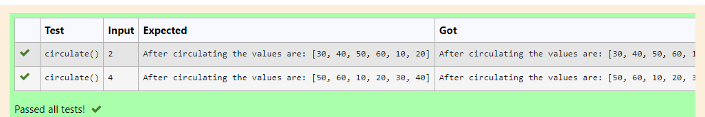

# Circulate-the-values-of-N-variables
## Aim:
To write a python program to circulate the n variables using function concept
## Equipment’s required:
PC
Anaconda - Python 3.7
## ALGORITHM:
### Step 1:
Import def circulate

### Step 2:
Prepare the lists from each linear equations

### Step 3:
Get the value from the user for the number of rotation

### Step 4:
Using the slicing concept rotate the list

### Step 5:
Print the values it would be criculated

### Step 6:
End the programm
### PROGRAM:
~~~
def circulate():
    l=[10,20,30,40,50,60]
    n=int(input())
    result=l[n: ]+l[ :n]
    print("After circulating the values are:", result)
~~~
## Output:

## Result: 
Thus the program is executed
